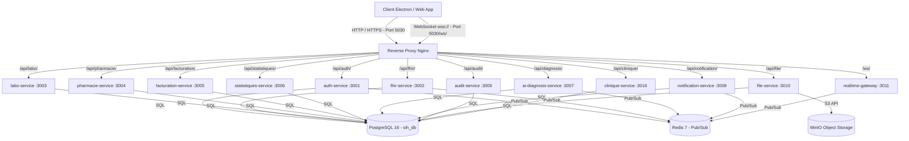

# Fonctionnement Global et Guide de Communication de Willo Server

Ce document constitue la référence technique complète expliquant le fonctionnement interne, l'architecture de données et les règles de communication avec l'intégralité des **12 microservices** de la plateforme **Willo**.

---

## 🏗️ 1. Architecture Globale et Infrastructure

Le serveur **Willo** repose sur une architecture microservices orientée événements, conçue pour supporter un fonctionnement à la fois **en ligne et hors-ligne (offline-first)**.



### Principes d'Architecture
1. **Pas d'ORM** : Accès direct et performant à PostgreSQL via requêtes brutes SQL avec `@fastify/postgres`.
2. **Isolation des Données** : Une base de données unique (`sih_db`) partitionnée en **11 schémas PostgreSQL distincts** (`auth`, `fhir`, `labo`, `pharmacie`, `facturation`, `statistiques`, `ai`, `notification`, `audit`, `files`, `clinique`).
3. **HL7 FHIR R4** : Le service `fhir-service` agit comme source de vérité pour toutes les données médicales normalisées (`Patient`, `Encounter`, `Observation`, etc.).
4. **Idempotence & Sync** : Traitement des mutations clientes via `clientMutationId` pour éviter la duplication lors des reconnexions.

---

## 🔄 2. Les Deux Canaux de Communication

Toute communication entre le client et Willo Server emprunte l'un des deux canaux suivants :

### A. Canal REST / HTTPS (Port `5030` via Proxy ou Ports Directs)
- **Rôle** : Exécuter des actions métier garanties (création, modification, consultation de données, synchronisation incrémentale).
- **Format** : JSON (`Content-Type: application/json`).
- **En-tête d'Authentification** : `Authorization: Bearer <accessToken_JWT>`.

### B. Canal WebSocket Temps Réel (`ws://localhost:5030/ws/` ou `:3011`)
- **Rôle** : Diffusion instantanée des événements du serveur vers les postes clients (mises à jour de dossiers, alertes de stock, nouveaux résultats de labo).
- **Authentification** : Premier message applicatif envoyé dans les 5 secondes : `{ "type": "auth", "token": "<JWT>" }`.
- **Heartbeat** : Ping applicatif du serveur toutes les 25 secondes.

---

## 🗺️ 3. Cartographie Réseau des Microservices

| Service | Port Direct | Prefix Nginx | Schéma PostgreSQL | Rôle Principal |
| :--- | :--- | :--- | :--- | :--- |
| **`auth-service`** | `3001` | `/api/auth/` | `auth` | Comptes, Authentification JWT, Rôles, Sessions, Code d'appairage |
| **`fhir-service`** | `3002` | `/api/fhir/` | `fhir` | Dossier patient HL7 FHIR R4 (table JSONB `fhir_resources`) |
| **`labo-service`** | `3003` | `/api/labo/` | `labo` | Catalogue de tests, Demandes d'analyses, Saisie des résultats |
| **`pharmacie-service`** | `3004` | `/api/pharmacie/` | `pharmacie` | Gestion des stocks, Mouvements de lots, Dispensations |
| **`facturation-service`** | `3005` | `/api/facturation/` | `facturation` | Tarifs d'actes, Factures, Encaissements et règlements |
| **`statistiques-service`** | `3006` | `/api/statistiques/` | `statistiques` | Indicateurs de santé, Snapshots analytiques, Dashboards |
| **`ai-diagnosis-service`** | `3007` | `/api/diagnosis/` | `ai` | Exécution des modèles IA ONNX, Évaluation des risques, Logs |
| **`notification-service`** | `3008` | `/api/notification/` | `notification` | Templates de messages, Envoi de SMS/Push, Préférences |
| **`audit-service`** | `3009` | `/api/audit/` | `audit` | Registre de sécurité FHIR AuditEvent, Traçabilité des accès |
| **`file-service`** | `3010` | `/api/file/` | `files` | Métadonnées de fichiers et stockage S3 MinIO (Imagerie, DICOM) |
| **`realtime-gateway`** | `3011` | `/ws/` | — | Serveur WebSocket & Relais Pub/Sub Redis |
| **`clinique-service`** | `3016` | `/api/clinique/` | `clinique` | Orchestration des flux de consultations médicales |

---

## 🛠️ 4. Fonctionnement Détaillé et Requêtes par Service

---

### 🔑 4.1. Auth Service (`auth-service`)

#### Fonctionnement Interne
`auth-service` gère l'identité des soignants et agents du centre de santé. Il vérifie les mots de passe hachés avec **bcrypt**, génère les jetons **JWT** (`accessToken` expirable à 15m, `refreshToken` expirable à 7d), enregistre les sessions actives dans la table `auth.sessions`, et attribue les rôles métier (`médecin`, `infirmier`, `pharmacien`, `laborantin`, `accueil`, `admin`).

#### Tables SQL (`auth` schema)
- `users` : Utilisateurs, identifiants, hash de mot de passe, rôles rattachés.
- `roles` & `user_roles` : Rôles et liste des permissions applicatives.
- `sessions` : Refresh tokens actifs et traçabilité IP / poste.
- `pairing_codes` : Codes temporaires d'appairage à 6 chiffres pour postes de travail.

#### Requêtes API Principales

##### 1. Authentification (`POST /api/auth/login`)
```bash
curl -X POST http://localhost:5030/api/auth/login \
  -H "Content-Type: application/json" \
  -d '{
    "email": "medecin@willo.health",
    "password": "Password123!",
    "posteId": "poste-uuid-001"
  }'
```
**Réponse (`200 OK`)** :
```json
{
  "tokens": {
    "accessToken": "eyJhbGciOiJIUzI1Ni...",
    "refreshToken": "7c9e-...",
    "expiresIn": 900
  },
  "user": {
    "id": "u-medecin-01",
    "email": "medecin@willo.health",
    "nom": "KABORE",
    "prenom": "Jean",
    "roles": [{"nom": "médecin", "permissions": ["patient:read", "patient:write"]}]
  }
}
```

##### 2. Rafraîchissement de Token (`POST /api/auth/refresh`)
```bash
curl -X POST http://localhost:5030/api/auth/refresh \
  -H "Content-Type: application/json" \
  -d '{ "refreshToken": "7c9e-..." }'
```

##### 3. Obtenir le Profil Courant (`GET /api/auth/me`)
```bash
curl -X GET http://localhost:5030/api/auth/me \
  -H "Authorization: Bearer <accessToken>"
```

##### 4. Générer un Code d'Appairage de Poste (`POST /api/auth/pairing/code`)
```bash
curl -X POST http://localhost:5030/api/auth/pairing/code \
  -H "Content-Type: application/json" \
  -d '{ "siteId": "site-centre-01" }'
```

---

### 🏥 4.2. FHIR Service (`fhir-service`)

#### Fonctionnement Interne
`fhir-service` est le moteur clinique principal de Willo. Il stocke et interroge des objets au format international **HL7 FHIR R4**. Il utilise la table générique `fhir.fhir_resources` avec une colonne `content JSONB` indexée par **GIN**, plus des colonnes dénormalisées (`subject_id`, `status`, `last_updated`, `client_mutation_id`).

#### Fonctionnalités Clés
1. **Idempotence (`clientMutationId`)** : Si le client réémet la même mutation avec le même `clientMutationId`, le serveur renvoie la ressource existante (`200 OK`) sans créer de doublon.
2. **Delta Sync (`_lastUpdated`)** : Permet de récupérer uniquement les données modifiées depuis un horodatage donné.
3. **Conflit de Version (`409 Conflict`)** : Envoie du header `If-Match: W/"versionId"`. Si la version sur le serveur a changé, une réponse `409` est renvoyée.
4. **Publication Temps Réel** : Lors de chaque écriture, un événement `willo:resource:<Type>` est publié sur **Redis**.

#### Requêtes API Principales

##### 1. Créer ou Mettre à Jour de façon Idempotente (`POST /api/fhir/Patient`)
```bash
curl -X POST http://localhost:5030/api/fhir/Patient \
  -H "Content-Type: application/json" \
  -H "Authorization: Bearer <accessToken>" \
  -H "X-Client-Mutation-Id: mut-uuid-12345" \
  -d '{
    "resourceType": "Patient",
    "name": [{ "family": "SAWADOGO", "given": ["Awa"] }],
    "gender": "female",
    "birthDate": "1995-04-12",
    "telecom": [{ "system": "phone", "value": "+22670001122" }]
  }'
```

##### 2. Requête Incrémentale / Delta Sync (`GET /api/fhir/Observation`)
```bash
curl -X GET "http://localhost:5030/api/fhir/Observation?_lastUpdated=gt2026-08-29T00:00:00Z&subject=pat-123" \
  -H "Authorization: Bearer <accessToken>"
```

##### 3. Bootstrap de Synchronisation par Rôle (`GET /api/fhir/sync/bootstrap`)
```bash
curl -X GET http://localhost:5030/api/fhir/sync/bootstrap \
  -H "Authorization: Bearer <accessToken>"
```

---

### 🧪 4.3. Labo Service (`labo-service`)

#### Fonctionnement Interne
`labo-service` orchestre le workflow des analyses médicales. Il gère le catalogue d'examens (`labo.test_catalog`) et le suivi des demandes d'analyses (`labo.labo_request_status`). Lors de la saisie d'un résultat d'analyse, il interagit avec `fhir-service` pour enregistrer les ressources `DiagnosticReport`, `Specimen` et `Observation`.

#### Requêtes API Principales

##### 1. Consulter le Catalogue d'Examens (`GET /api/labo/catalog`)
```bash
curl -X GET http://localhost:5030/api/labo/catalog \
  -H "Authorization: Bearer <accessToken>"
```

##### 2. Ajouter un Examen au Catalogue (`POST /api/labo/catalog`)
```bash
curl -X POST http://localhost:5030/api/labo/catalog \
  -H "Content-Type: application/json" \
  -H "Authorization: Bearer <accessToken>" \
  -d '{
    "code": "NFS",
    "nom": "Numération Formule Sanguine",
    "categorie": "Hématologie",
    "delaiExecutionMinutes": 60,
    "prix": 3500
  }'
```

---

### 💊 4.4. Pharmacie Service (`pharmacie-service`)

#### Fonctionnement Interne
`pharmacie-service` contrôle l'inventaire des produits pharmaceutiques (`pharmacie.stock_items`) et l'historique des mouvements de stock (`pharmacie.stock_movements`). Il offre une vue SQL matérialisée `v_stock_alertes` pour détecter automatiquement les ruptures et péremptions imminentes. Lors d'une dispensation d'ordonnance, il déduit la quantité en stock de façon atomique.

#### Requêtes API Principales

##### 1. Consulter l'État du Stock et Alertes (`GET /api/pharmacie/stock`)
```bash
curl -X GET http://localhost:5030/api/pharmacie/stock \
  -H "Authorization: Bearer <accessToken>"
```

##### 2. Enregistrer une Entrée / Sortie de Stock (`POST /api/pharmacie/stock/movement`)
```bash
curl -X POST http://localhost:5030/api/pharmacie/stock/movement \
  -H "Content-Type: application/json" \
  -H "Authorization: Bearer <accessToken>" \
  -d '{
    "stockItemId": "item-paracetamol-500",
    "typeMouvement": "ENTREE",
    "quantité": 200,
    "motif": "Approvisionnement mensuel",
    "opérateurId": "u-medecin-01"
  }'
```

---

### 💰 4.5. Facturation Service (`facturation-service`)

#### Fonctionnement Interne
`facturation-service` gère la chaîne financière de l'établissement : la grille des prix d'actes (`facturation.tarif_actes`), l'émission de factures (`facturation.invoices` & `invoice_lines`) et l'encaissement des règlements (`facturation.payments`). Il calcule en temps réel le solde restant dû par le patient ou la prise en charge assurance via la vue `v_invoice_balance`.

#### Requêtes API Principales

##### 1. Créer une Facture (`POST /api/facturation/invoices`)
```bash
curl -X POST http://localhost:5030/api/facturation/invoices \
  -H "Content-Type: application/json" \
  -H "Authorization: Bearer <accessToken>" \
  -d '{
    "patientId": "pat-uuid-01",
    "couvertureId": "cov-assurance-80",
    "lignes": [
      { "acteCode": "CONS-MED", "libellé": "Consultation Généraliste", "quantité": 1, "prixUnitaire": 5000 }
    ]
  }'
```

##### 2. Enregistrer un Règlement (`POST /api/facturation/payments`)
```bash
curl -X POST http://localhost:5030/api/facturation/payments \
  -H "Content-Type: application/json" \
  -H "Authorization: Bearer <accessToken>" \
  -d '{
    "invoiceId": "inv-uuid-8899",
    "montant": 5000,
    "mode": "espèce"
  }'
```

---

### 📊 4.6. Statistiques Service (`statistiques-service`)

#### Fonctionnement Interne
`statistiques-service` agrège les données cliniques, épidémiologiques et financières. Il stocke les définitions d'indicateurs dans `statistiques.indicators` et conserve des instantanés calculés dans `statistiques.report_snapshots` (vue `v_latest_snapshots`).

#### Requêtes API Principales

##### 1. Consulter les Indicateurs Métier (`GET /api/statistiques/indicators`)
```bash
curl -X GET http://localhost:5030/api/statistiques/indicators \
  -H "Authorization: Bearer <accessToken>"
```

---

### 🤖 4.7. AI Diagnosis Service (`ai-diagnosis-service`)

#### Fonctionnement Interne
`ai-diagnosis-service` exécute des modèles d'apprentissage automatique au format **ONNX** pour l'aide au diagnostic médical (ex: prédiction du risque de sepsis, dépistage du paludisme). Les versions des modèles sont référencées dans `ai.model_versions` et chaque prédiction est tracée dans `ai.inference_logs`.

#### Requêtes API Principales

##### 1. Exécuter une Inférence d'Aide au Diagnostic (`POST /api/diagnosis/predict`)
```bash
curl -X POST http://localhost:5030/api/diagnosis/predict \
  -H "Content-Type: application/json" \
  -H "Authorization: Bearer <accessToken>" \
  -d '{
    "nomModele": "sepsis-risk-v1",
    "patientId": "pat-uuid-01",
    "features": {
      "temperature": 38.9,
      "frequenceCardiaque": 115,
      "pressionArterielle": 90
    }
  }'
```

---

### 🔔 4.8. Notification Service (`notification-service`)

#### Fonctionnement Interne
`notification-service` permet l'envoi de messages d'alerte multi-canaux (SMS via passerelle locale/GSM, notifications in-app via WebSocket, Email). Il stocke les templates de messages dans `notification.notification_templates` et les historiques dans `notification.notifications` et `notification.sms_messages`.

#### Requêtes API Principales

##### 1. Envoyer une Notification SMS (`POST /api/notification/send`)
```bash
curl -X POST http://localhost:5030/api/notification/send \
  -H "Content-Type: application/json" \
  -H "Authorization: Bearer <accessToken>" \
  -d '{
    "destinataireId": "pat-uuid-01",
    "telephone": "+22670112233",
    "canal": "SMS",
    "templateId": "tmpl-rappel-rdv",
    "variables": { "date": "30/08/2026", "heure": "09:00" }
  }'
```

---

### 📋 4.9. Audit Service (`audit-service`)

#### Fonctionnement Interne
`audit-service` garantit la conformité légale et la sécurité médicale. Il enregistre toutes les actions sensibles (consultation de dossier, modification d'ordonnance, suppression) sous forme de ressources `AuditEvent` FHIR dans la table `audit.audit_events` ainsi que les accès réseau HTTP dans `audit.access_logs`.

#### Requêtes API Principales

##### 1. Rechercher dans le Registre d'Audit (`GET /api/audit/events`)
```bash
curl -X GET "http://localhost:5030/api/audit/events?userId=u-medecin-01&limit=50" \
  -H "Authorization: Bearer <accessToken>"
```

---

### 📁 4.10. File Service (`file-service`)

#### Fonctionnement Interne
`file-service` gère le stockage des fichiers volumineux (imagerie DICOM, bilans scannés, pièces jointes PDF). Les fichiers sont conservés sur **MinIO S3** dans le bucket `willo-files`. La table `files.file_metadata` indexe l'emplacement S3, la taille et le type MIME, tout en créant la ressource FHIR `DocumentReference` ou `Binary`.

#### Requêtes API Principales

##### 1. Uploader un Fichier / Imagerie (`POST /api/file/upload`)
```bash
curl -X POST http://localhost:5030/api/file/upload \
  -H "Authorization: Bearer <accessToken>" \
  -F "file=@/chemin/vers/radiographie.png" \
  -F "patientId=pat-uuid-01" \
  -F "categorie=radiologie"
```

##### 2. Obtenir une URL de Téléchargement Securisée (`GET /api/file/:fileId/download`)
```bash
curl -X GET http://localhost:5030/api/file/file-uuid-123/download \
  -H "Authorization: Bearer <accessToken>"
```

---

### ⚡ 4.11. Realtime Gateway & Découverte Bonjour (`realtime-gateway`)

#### Fonctionnement Interne
`realtime-gateway` a deux responsabilités majeures :
1. **Serveur WebSocket Temps Réel** : Il écoute le bus de messages **Redis Pub/Sub** sur le canal `willo:*`. Lorsqu'un microservice (ex: `fhir-service`) modifie une donnée, il publie un message Redis. `realtime-gateway` le réceptionne et le retransmet instantanément aux WebSocket connectés abonnés au canal concerné.
2. **Découverte Réseau ZeroConf / Bonjour (`bonjour-service`)** : Dès son démarrage, le serveur annonce automatiquement sa présence sur le réseau local LAN via Multicast DNS (mDNS) grâce à la bibliothèque `bonjour-service`. Les postes clients (Electron) découvrent ainsi automatiquement l'adresse IP et le port du serveur sans saisie manuelle.

#### Annonce Bonjour / mDNS (Spécifications ZeroConf)
- **Type de service** : `_willo._tcp` / `_http._tcp`
- **Port publié** : `5030` (Reverse Proxy Nginx)
- **Enregistrement TXT diffusé** :
```json
{
  "siteName": "Centre de Santé Willo",
  "apiVersion": "1.0",
  "caFingerprint": "sha256-fingerprint...",
  "authPort": "3001",
  "wsPort": "3011",
  "proxyPort": "5030"
}
```

#### Requête HTTP de Découverte de Secours (`GET /discovery`)
Si le trafic Multicast est filtré sur le switch ou le réseau du centre de santé, le client peut interroger cet endpoint de fallback :

```bash
curl -X GET http://localhost:5030/discovery
```
**Réponse (`200 OK`)** :
```json
{
  "service": "willo-server",
  "siteName": "Centre de Santé Willo",
  "apiVersion": "1.0",
  "caFingerprint": "sha256-fingerprint...",
  "ports": { "proxy": 5030, "auth": 3001, "fhir": 3002, "realtime": 3011 }
}
```

#### Workflow d'Appairage d'un Nouveau Poste
```
┌─────────────────┐       1. Découverte mDNS / Bonjour        ┌─────────────────────┐
│  Poste Client   │ ─────────────────────────────────────────► │  realtime-gateway   │
│  (Nouveau)      │ ◄───────────────────────────────────────── │  (Port 5030)        │
└────────┬────────┘      Annonce du serveur (IP + Ports)      └─────────────────────┘
         │
         │ 2. Saisie du Code à 6 chiffres (ex: 849201)
         ▼
┌─────────────────┐       3. Validation & Enregistrement       ┌─────────────────────┐
│  POST /pairing  │ ─────────────────────────────────────────► │    auth-service     │
│  (auth-service) │ ◄───────────────────────────────────────── │  (table auth.postes)│
└─────────────────┘      Certificat & Token de Poste           └─────────────────────┘
```

#### Protocole WebSocket

1. **Connexion** : `ws://localhost:5030/ws/`
2. **Authentification (Message 1 - dans les 5 secondes)** :
```json
{
  "type": "auth",
  "token": "<accessToken_JWT>"
}
```
3. **Réponse d'authentification réussie du serveur** :
```json
{
  "type": "auth.ok",
  "channels": [
    "user:u-medecin-01",
    "role:médecin",
    "site:site-centre-01",
    "resource:Patient",
    "resource:Encounter"
  ],
  "timestamp": "2026-08-29T14:50:00.000Z"
}
```
4. **Message d'Événement Temps Réel Reçu** :
```json
{
  "id": "evt-uuid-99",
  "type": "resource.updated",
  "channel": "resource:Patient",
  "payload": {
    "resourceType": "Patient",
    "fhirId": "pat-uuid-01",
    "resource": { "id": "pat-uuid-01", "resourceType": "Patient", "active": true }
  },
  "timestamp": "2026-08-29T14:50:02.123Z"
}
```

---

### 🩺 4.12. Clinique Service (`clinique-service`)

#### Fonctionnement Interne
`clinique-service` orchestre le déroulement de la consultation médicale. Il fournit des agrégats rapides regroupant l'historique récent du patient, les constantes vitales, les motifs de consultation et les prescriptions en cours, évitant de multiples requêtes unitaires au client.

#### Requêtes API Principales

##### 1. Résumé de Consultation Patient (`GET /api/clinique/consultations/patient/:patientId`)
```bash
curl -X GET http://localhost:5030/api/clinique/consultations/patient/pat-uuid-01 \
  -H "Authorization: Bearer <accessToken>"
```

---

## 💻 5. Guide de Démarrage Développeur

### Fichier de Configuration (`.env`)
Assurez-vous que le fichier `.env` à la racine de `willo-server` contient la configuration nécessaire :
```env
POSTGRES_USER=sih_admin
POSTGRES_PASSWORD=change_me_in_production
POSTGRES_DB=sih_db
POSTGRES_HOST=postgres
POSTGRES_PORT=5432

JWT_SECRET=change_me_very_long_secret_min_32_chars
REDIS_URL=redis://redis:6379

MINIO_ROOT_USER=minio_admin
MINIO_ROOT_PASSWORD=change_me_in_production
```

### Démarrage des Conteneurs Docker
Pour compiler et démarrer l'ensemble des 12 microservices, de la base de données PostgreSQL, de Redis et de Nginx :
```bash
docker compose up --build -d
```

### Vérification de Santé (Health Checks)
Chaque service expose un endpoint `/health` vérifiant son statut applicatif et sa connexion à PostgreSQL :
```bash
# Vérifier la passerelle Nginx
curl http://localhost:5030/health

# Vérifier auth-service
curl http://localhost:3001/health

# Vérifier fhir-service
curl http://localhost:3002/health

# Vérifier realtime-gateway
curl http://localhost:3011/health
```
